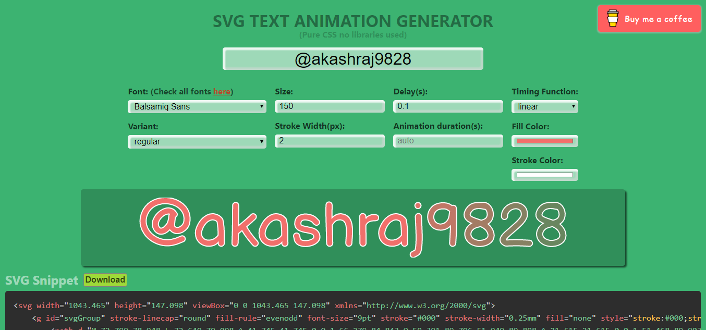
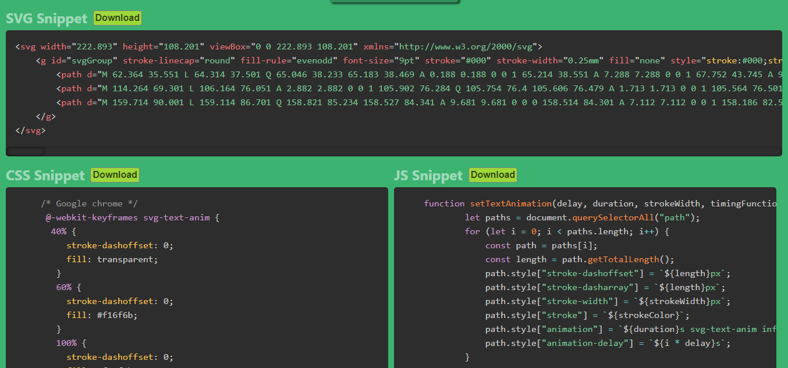

# SVG TEXT ANIMATION GENERATOR
## (Pure CSS no libraries used)
### Generate SVG for **any TEXT** in **991 diffrent fonts**(google fonts) and animate it without using any library. in under 15 lines of code.

### Animations are purely done using keyframes

> ## Screens
> ### Use any of the google fonts
> 

> ### Download all code.
> 

> ### 
> 

> ## Available Scripts

In the project directory, you can run:
### `yarn start`
Runs the app in the development mode. 
Open [http://localhost:3000](http://localhost:3000) to view it in the browser.

### `yarn build`

Builds the app for production to the `build` folder. 
It correctly bundles React in production mode and optimizes the build for the best performance.
